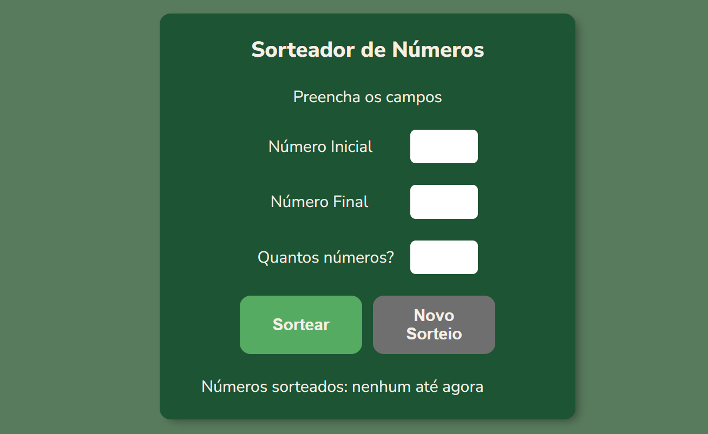

# :sparkles: Número Sorteado

**Projeto para treinamento de funções de Javascript**

Projeto criado para simular um sorteador de números, fazendo o usuario digitar o número inicial e o final e quantos números quer que seja sorteado. Nesse projeto exclui números repetidos.

---

## :computer: Linguagem Utilizadas

- `HTML5`
- `CSS`
- `Javascript`

---

## 📁 Acesso ao projeto

**Indique como é possível baixar ou acessar o código fonte do projeto, seja projeto inicial ou final**

---

### :brain: Fixando o Aprendizado

- Coletado as info digitadas no campo de dados
- Criado a condição de erro caso o usuario digite algum numero incorreto nos campos.
- Criado a lista para inserir os numeros sorteado e depois apresentar na tela.
- Criado a condição para percorrer e preencher a lista de acordo com a quantidade de numeros que o usuario escolher.
- Inserido os valores na lista e ordenado os numeros.
- Alterado a mensagem que aparece no campo de "numeros sorteados"
- Criado a função do botão novo sorteio
- Habilitado o botão de novo sorteio.
- E criado a função de limpar os campos.
